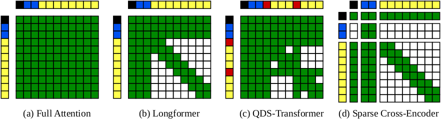

# Sparse Cross-Encoders

This repository contains the code for the paper [Investigating the Effects of Sparse Attention on Cross-Encoders](https://webis.de/publications.html#schlatt_2024a) (ECIR'24).

[](https://codespaces.new/webis-de/ecir24-sparse-cross-encoder)

<p align="center">
  
</p>
<p align="center">
<b>Figure 1:</b> The efficient Sparse Cross-Encoder attention pattern compared with previous cross-encoder attention patterns. Black tokens are CLS tokens, blue tokens are query tokens, red tokens are special sentence separator tokens, and yellow tokens are document tokens.
</p>

## Models

We provide two already fine-tuned models. Each uses a window size of 4 but support a maximum sequence length of 512/4096 tokens.

| Model Name                                                                              | Window Size | Maximum Sequence Length | TREC DL nDCG@10  | TIREx nDCG@10 |
| --------------------------------------------------------------------------------------- | ----------- | ----------------------- | ---------------- | ------------- |
| [sparse-cross-encoder-4-512](https://huggingface.co/webis/sparse-cross-encoder-4-512)   | 4           | 512                     | 0.612 (Passage)  | 0.365         |
| [sparse-cross-encoder-4-4096](https://huggingface.co/webis/sparse-cross-encoder-4-4096) | 4           | 4096                    | 0.577 (Document) | 0.260         |


## Installation

To test the sparse cross-encoder without installing anything locally, you can use the provided GitHub CodeSpaces environment by clicking the button above. The [usage-example.ipynb](./notebooks/usage-example.ipynb) notebook contains a simple example of how to use the sparse cross-encoder.

### Docker

The easiest way to use the sparse cross-encoder locally is to use our provided Docker container [fschlatt/sparse-cross-encoder](https://hub.docker.com/repository/docker/fschlatt/sparse-cross-encoder/general).

### Manual Installation

Using the sparse cross-encoder requires installing the [pytorch window matmul](https://github.com/webis-de/pytorch-window-matmul) library, and uses the [transformers](https://github.com/huggingface/transformers), [ir-datasets](https://github.com/allenai/ir_datasets), and [lightning](https://github.com/Lightning-AI/pytorch-lightning) libraries.

## Usage

The main entrypoint for running the sparse cross-encoder is the `main.py` script. It uses the [lightning](https://github.com/Lightning-AI/pytorch-lightning) library to provide a simple interface for training and running inference.

### Inference

To run inference, call the `main.py` script with the `predict` option. The script additionally needs a config yaml file which passes parameters such as batch size etc. See the [predict.yaml](./sparse_cross_encoder/configs/cli/predict.yaml) for an example. The config file should specify the path to a run file (TREC or JSON format), the model you would like to use (can be a model from the huggingface hub or a local model), and the output path where the re-ranked run file should be saved. These options can also be passed as command line arguments.

For example, the following command runs inference on TREC DL 2019 with first-stage retrieval by BM25.

```sh
python main.py predict \
    --config sparse_cross_encoder/configs/cli/predict.yaml \
    --data.ir_dataset_path tests/data/msmarco-passage-trec-dl-2019-judged.run \
    --model.model_name_or_path webis/sparse-cross-encoder-4-512 \
    --trainer.callbacks.output_path run.txt
```

#### Run file formats

Two run file formats are supported: TREC and JSON. If passing a TREC formatted file, the name should correspond to an ir-datasets dataset with underscores replaced by dashes. For example, the run file `msmarco-passage-trec-dl-2019-judged.run` corresponds to the [`msmarco-passage/trec-dl-2019/judged`](https://ir-datasets.com/msmarco-passage.html#msmarco-passage/trec-dl-2019/judged) dataset. The script will automatically download the passages and queries.

The other option is to pass a JSON (can also be JSONL) file of the following format:

```json
[
  {
    "qid": "1",
    "query": "hubble telescope achievements",
    "docno": "doc-3",
    "text": "The Hubble telescope discovered two moons of Pluto, Nix and Hydra.",
    "rank": 1,
    "score": 10
  },
  {
    "qid": "1",
    "query": "hubble telescope achievements",
    "docno": "doc-4",
    "text": "Edwin Hubble, an astronomer with great achievement, completely reimagined our place in the universe (the telescope is named by him).",
    "rank": 2,
    "score": 9
  },
  {
    "qid": "2",
    "query": "how to exit vim?",
    "docno": "doc-1",
    "text": "Press ESC key, then the : (colon), and type the wq command after the colon and hit the Enter key to save and leave Vim.",
    "rank": 1,
    "score": 10
  },
  {
    "qid": "2",
    "query": "how to exit vim?",
    "docno": "doc-2",
    "text": "In Vim, you can always press the ESC key on your keyboard to enter the normal mode in the Vim editor.",
    "rank": 2,
    "score": 9
  }
]
```

### Fine-tuning

To fine-tune a model, the `main.py` script can be called with the `train` option. The script additionally needs a config yaml file which contains model, data, and trainer parameters. See the [train.yaml](./sparse_cross_encoder/configs/cli/train.yaml) for an example. It is configured to exactly reproduce the provided [webis/sparse-cross-encoder-4-512](https://huggingface.co/webis/sparse-cross-encoder-4-512) model. To obtain a full list of available options, run `python main.py train -h`.

```sh
python main.py fit --config sparse_cross_encoder/configs/cli/train.yaml
```

## Cite

```bib
@InProceedings{schlatt:2024a,
  author =                   {Ferdinand Schlatt and Maik Fr{\"o}be and Matthias Hagen},
  booktitle =                {Advances in Information Retrieval. 46th European Conference on IR Research (ECIR 2024)},
  doi =                      {10.1007/978-3-031-56027-9_11},
  editor =                   {Nazli Goharian and Nicola Tonellotto and Yulan He and Aldo Lipani and Graham McDonald and Craig Macdonald and Iadh Ounis},
  month =                    mar,
  pages =                    {173--190},
  publisher =                {Springer},
  series =                   {Lecture Notes in Computer Science},
  site =                     {Glasgow, Scotland},
  title =                    {{Investigating the Effects of Sparse Attention on Cross-Encoders}},
  volume =                   14608,
  year =                     2024
}
```
